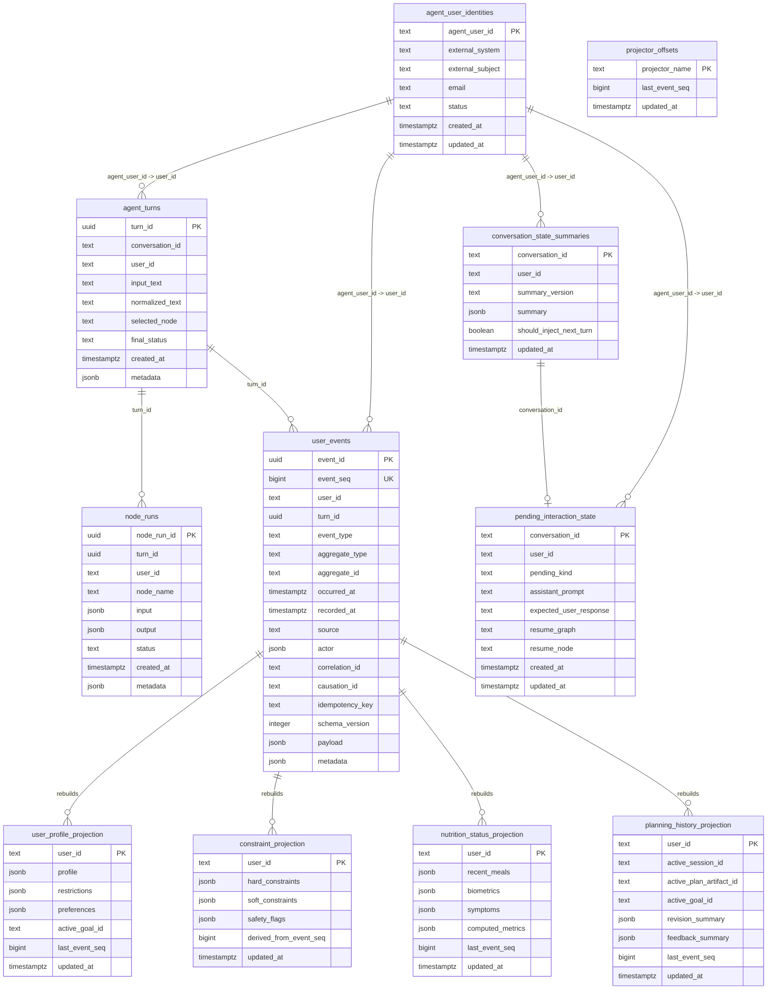

# PostgreSQL Schema

Agent-local PostgreSQL database for identity references, runtime traceability, immutable user
events, rebuildable projections, and compact conversation continuity.

This database is separate from the webapp database. It does not own platform auth or webapp user
records.

Required extension:

```sql
CREATE EXTENSION IF NOT EXISTS pgcrypto;
```

## Mermaid ERD



## Notes

- `user_events` is the source of truth.
- Projection tables are derived state and can be rebuilt.
- `node_runs.turn_id` and `user_events.turn_id` are logical links to `agent_turns.turn_id`; V1
  does not require hard foreign keys.
- `conversation_state_summaries` and `pending_interaction_state` store compact conversation
  continuity only.
- `event_type` remains `TEXT`; validation belongs in `docs/contracts/event-registry.yml`
  and code registries.
- Idempotent event writes are enforced by a unique index on `(user_id, idempotency_key)` when
  `idempotency_key` is not null.
- LangGraph checkpoint and Store tables are created by the LangGraph PostgreSQL setup and remain
  library-owned; this schema documents only repository-owned tables.

## Indexes

```text
agent_user_identities(email)
agent_user_identities(external_system, external_subject) unique

agent_turns(user_id, created_at)
agent_turns(conversation_id, created_at)
agent_turns(selected_node)

node_runs(turn_id)
node_runs(user_id, created_at)
node_runs(node_name)

user_events(user_id, event_seq)
user_events(user_id, occurred_at)
user_events(user_id, recorded_at)
user_events(event_type)
user_events(aggregate_type, aggregate_id)
user_events(turn_id)
user_events(payload) gin
user_events(user_id, idempotency_key) unique where idempotency_key is not null

conversation_state_summaries(user_id, updated_at)
pending_interaction_state(user_id, updated_at)
```
